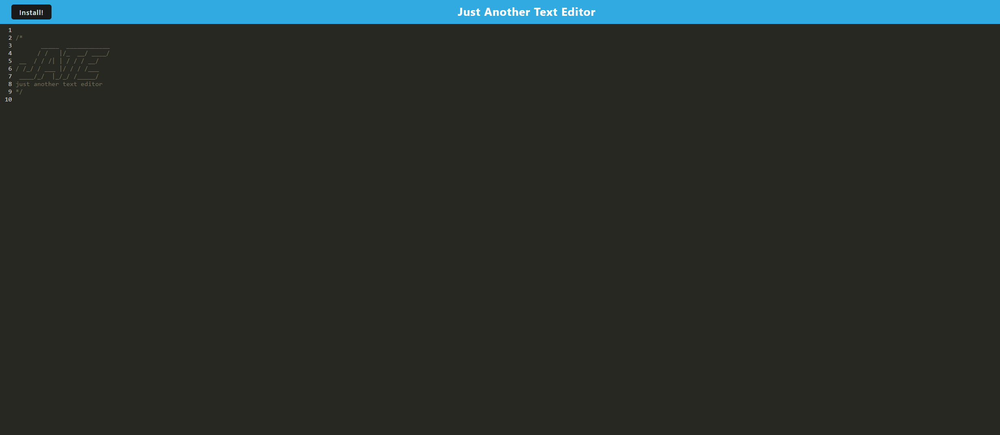

  # JATE-PWA Text Editor
  

  ## Description:
  ### Deployed:https://intense-castle-33602.herokuapp.com   
 

  ## Table of Contents:
  * [Installation](#installation)
  * [Usage](#usage)
  * [License](#license)
  * [Contributing](#contributing)
  * [Tests](#tests)
  * [Questions](#questions)
  
  ## Installation:
        To test this application, run `npm install` to make sure you have all the dependencies installed and `npm start` to start the application. Open `localhost:3000/` to view the application.
   

   ## Usage:
   This application is deployed here: https://intense-castle-33602.herokuapp.com/
   

  ## License: 
  
   
  Licensed under MIT License.
   

  ## Contributing:
  To contribute to this project, contact me at 
    my GitHub [Brandon Williams](https://github.com/brandonawilliams1).
   

  ## Tests:
  N/A
   
  
  ## Questions:
  If you have any questions, you can contact me at briannaewoodruff@gmail.com or visit my GitHub [Brandon Williams](https://github.com/brandonawilliams1). 
   ***This application was created from existing code and was done as a code-along in class. It was approved to be turned in.***   